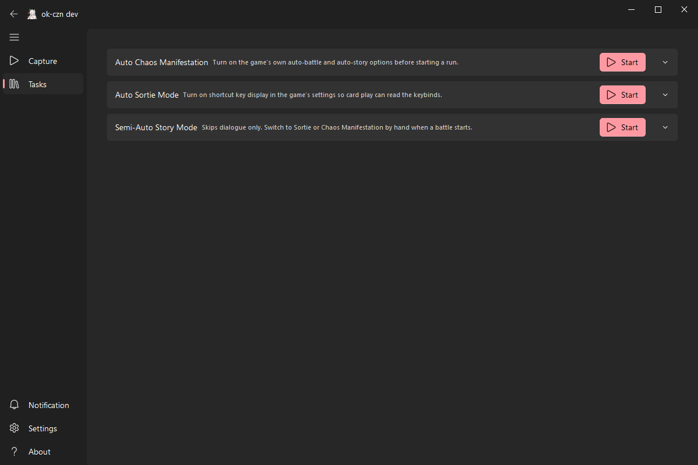
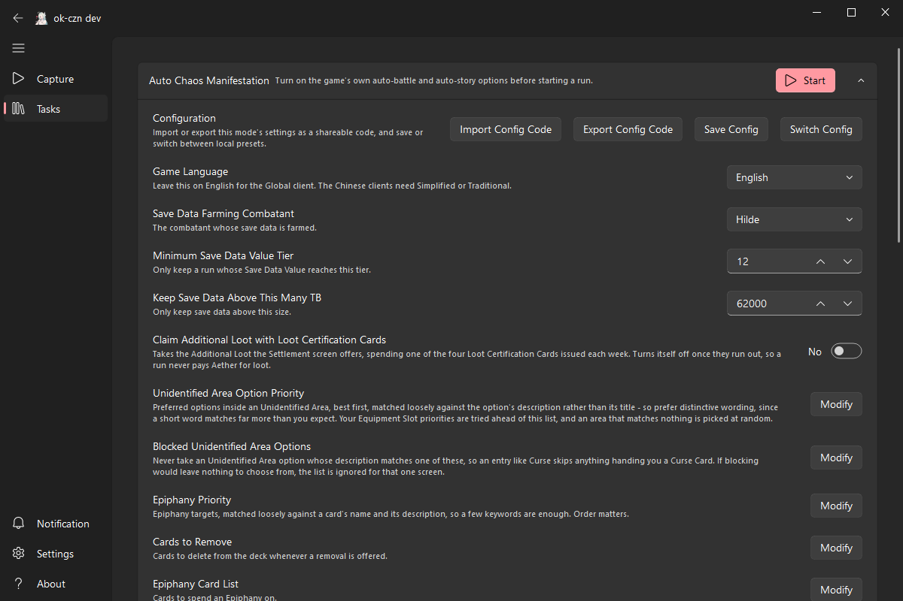
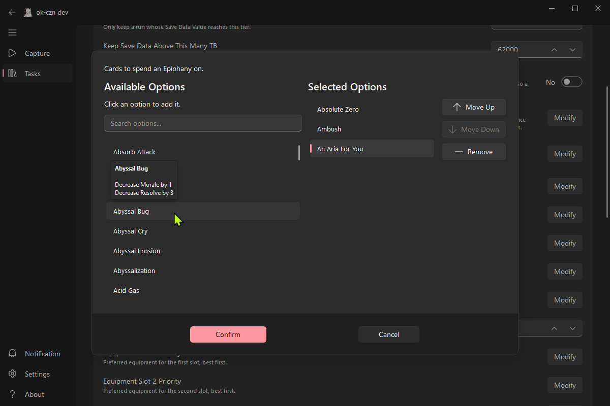

<div align="center">
  <h1 align="center">
    
    <br/>
    ok-czn
  </h1>

  <p>
    An image-recognition-based automation tool for Chaos Zero Nightmare, with background mode support, developed with <a href="https://github.com/ok-oldking/ok-script">ok-script</a>.
  </p>

  <p><i>Operates by simulating the Windows user interface, with no memory reading or file modification.</i></p>
</div>

<!-- Badges -->
<div align="center">


[](https://github.com/steve1316/ok-czn-english/releases)

</div>

> [!NOTE]
> A fork of [baoxin1100/ok-kes](https://github.com/baoxin1100/ok-kes) targeting the **Global (English)** client.
> Upstream's Simplified and Traditional Chinese support still ships and keeps working. The original work is
> baoxin1100's and ok-oldking's.

> [!IMPORTANT]
> **The Global client runs end to end.** Chaos and Sortie complete full runs in English. The game-text catalog
> still grows as new screens turn up, so an unfamiliar screen can stall a run.

---

## Disclaimer

> [!CAUTION]
> By using this software you acknowledge that you have read, understood and agreed to the statement below, and
> that you voluntarily assume all potential risks.

<details>
<summary>Read the full disclaimer</summary>

This software is an external auxiliary tool designed to automate parts of the gameplay for Chaos Zero Nightmare. It interacts with the game solely by simulating standard user interface actions. This project aims to simplify repetitive user tasks and does not disrupt game balance or provide an unfair advantage. It will never modify any game files or data.

This software is open-source and free, intended for personal learning purposes only. Any issues arising from the use of this software are not the responsibility of this project or its developers.

</details>

## Quick Start

1. **Download the installer** from [Releases](https://github.com/steve1316/ok-czn-english/releases).
2. **Install and run.** The program updates itself on launch.
3. **Start the game**, connect its window, then press **Start** on the mode you want under **Tasks**.

> [!WARNING]
> The game runs elevated, so run this as Administrator too. Without it Windows blocks every simulated click,
> and the app reports no error.

## Main Features



### Sortie Mode (Auto Battle)
- **Auto Battle**: card play driven by key recognition, with customizable play priority
- **Auto Card Management**: obtain, remove, copy and flash cards
- **Member Selection**: picks battle members by your priority configuration, and drafts by role when you have not set one
- **Route Selection**: recognises node types and advances by priority
- **Shop Handling**: enters the Dellang Shop to remove cards
- **Ether Supply Detection**: detects low stamina and exits

### Chaos Mode
- **Auto Card Management**: remove, copy, flash, grant flash and convert cards
- **Route Selection**: identifies rest, event, elite and normal enemy nodes
- **Event Choices**: prefers an Epiphany, then rewards, then a fight, and only ends an event when nothing else is offered
- **Dice Rolls**: rerolls a failed roll while it can afford to
- **Mental Breakdown Treatment**: visits the trauma center automatically
- **Save Data Handling**: deletes save data, with a configurable retention count
- **Zero System Support**: handles Codex search

### Story Mode (Semi-Auto)
- **Auto Dialogue**: skips story dialogue
- **Manual Mode Switching**: hand back to Sortie or Chaos mode for battles and chaos stages

### Buying and Keeping
- **Leave a priority list empty and the bot fills it in** from what is on screen, taking only Unique and Legend
  cards and equipment, and skipping a card no one on your team could hold. A list you configure always wins.

### Notifications
- **Windows notifications** when a run starts, when one finishes (with the floor reached and the running score),
  and when the bot has been stuck on one screen for a minute.

### Config Export & Import
- **Export**: encodes the current mode's configuration as a text code you can share
- **Import**: applies a shared configuration code, across versions

> [!NOTE]
> Upstream's config upload and popular-config browser are **removed** in this fork. The pool is the upstream CN
> community's, so a Global client's card and combatant names match nothing in it.

### Settings

Every setting is named and described in English, and each mode expands in place.



- **Names are picked from a list, not typed.** Cards, equipment and combatants come from the client's own
  localization data, so a typo cannot silently stop a setting matching. Long lists gain a search box.
- **Hover an option to see its in-game effect and base values.** Attack figures are the card's base coefficient,
  not the damage a particular Combatant would deal. Search matches names only.
- **Switching to this build re-seeds these settings once.** Upstream ships one Chinese player's build as the
  defaults, and those names can never match English OCR. Route Priority is the exception and keeps its original
  values, since those are internal labels rather than text read off the screen.



### General
- **Resolutions**: 1920x1080, 1600x900, 1280x720 and other 16:9 sizes
- **Background Mode**: runs while the game window is minimized or obscured
- **Clients**: Global (English) is this fork's focus. Simplified and Traditional Chinese still work, including
  Android emulators, via each mode's Game Language setting

## Usage Guide

1. **Global client**: nothing to set. Game Language already defaults to English, and the game text itself is
   handled by the reverse OCR catalog described below.
2. **Chinese clients**: set Game Language to Simplified or Traditional Chinese in the mode you use.
3. **Auto Battle**: card play reads the keybinds, so enable shortcut key display in the game's settings.
4. **Chaos Manifestation**: turn on the game's own auto-battle and auto-story options.
5. **Story Mode**: start Sortie Mode by hand for battle stages and Chaos Mode for chaos stages. Battle teams are
   configured manually.

## Troubleshooting

1. **Clicks do nothing**: run the app as Administrator. The game is elevated, and Windows blocks input sent to it
   from a normal process.
2. **Antivirus**: add the install directory to your antivirus exceptions, Windows Defender included.
3. **Display settings**: turn off graphics card filters and sharpening, use the game's default brightness, and
   disable overlays that draw on the game window.
4. **Resolution**: make sure the game is running at a 16:9 aspect ratio.
5. **Version**: check you are on the latest release.

---

## Developer Zone

### Running from source

```bash
pip install -r requirements.txt --upgrade

python main.py          # release mode
python main_debug.py    # debug mode, which adds the Debug and Run Code tabs
```

```powershell
.\run_tests.ps1         # every tests\Test*.py, each in its own process
```

### Translations

Two catalogs live under `i18n/`, and they run in **opposite directions**:

| Catalog | Direction | Holds |
| --- | --- | --- |
| `ok.po` | Chinese msgid to English msgstr | App UI labels, task names, setting descriptions |
| `ocr.po` | English msgid to Chinese msgstr | Game text read off the screen |

`ocr.po` is what makes the Chinese task code work against an English client. The framework applies it in
`OCR.fix_texts()` before any handler sees a text box, rewriting English game text into the Chinese literal the
handler compares against. That is why `ok_tasks/` needs no changes for the Global client.

> [!CAUTION]
> **Never put UI strings in `ocr.po`.** It rewrites game text, so a stray entry there corrupts recognition.

Every `ocr.po` entry carries a `# From <handler>: <literal>` comment naming the call site it serves. A merge from
upstream can then be diffed against those comments to find which new Chinese literals still need an English entry.

The app only ever reads the compiled `.mo`, so recompile after editing a `.po`:

```bash
python scripts/compile_i18n.py            # write the .mo files
python scripts/compile_i18n.py --check    # verify only, as CI does
```

To find the English text for a new entry, dump a screenshot the way the app reads it:

```bash
python scripts/ocr_dump.py <image> --missing
```

### Staying in sync with upstream

Upstream is `baoxin1100/ok-kes`. Changes here are kept additive so merges stay clean: `ok_tasks/` is left
byte-identical to upstream, and everything this fork changes lives in `src/en/` as a runtime patch.

```bash
git remote add upstream https://github.com/baoxin1100/ok-kes.git
git config merge.ours.driver true   # once per clone, for the README merge=ours rule
git fetch upstream && git merge upstream/master
```

## Credits

* [baoxin1100/ok-kes](https://github.com/baoxin1100/ok-kes) - the original project this fork is built on
* [ok-script](https://github.com/ok-oldking/ok-script)
* [OnnxOCR](https://github.com/ok-oldking/OnnxOCR)
* [PyQt-Fluent-Widgets](https://github.com/zhiyiYo/PyQt-Fluent-Widgets)
